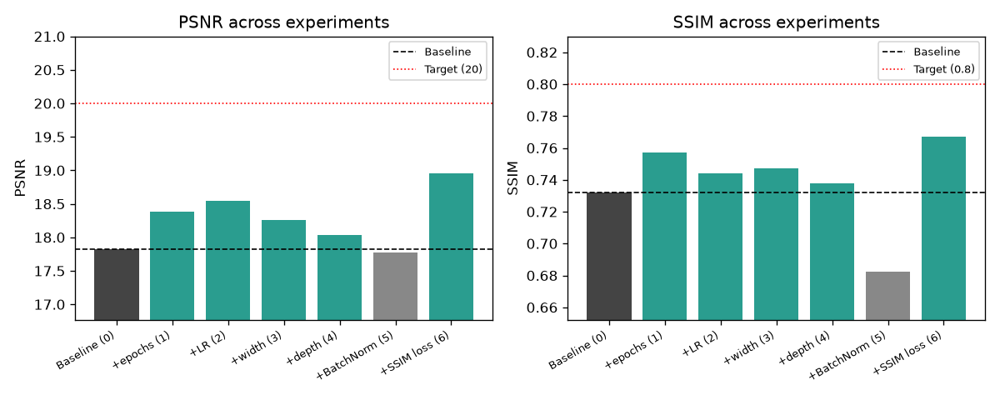

# Progress Log

Tracking each training run: config, results, and what we learned. Goal is
incremental improvement, not jumping straight to a complex architecture.

## Baseline model

`LowLightEnhanceNet` in `train.py` — 3 Conv2d layers (32 hidden channels),
ReLU between, Sigmoid output. No skip connections, no normalization. This is
intentionally the simplest possible baseline.

## Runs

### Run 1 — pipeline smoke test
- Config: `--epochs 3 --batch-size 8 --image-size 64`
- Loss: 0.1757 -> 0.1703 -> 0.1631
- Purpose: verify train.py runs end to end on real data. No real learning expected.

### Run 2 — MPS smoke test
- Config: `--epochs 2 --batch-size 8 --image-size 64`
- Confirmed `torch.backends.mps.is_available() == True` on M4, training ran
  successfully through MPS instead of CPU.
- Loss: 0.1745 -> 0.1691

### Run 3 — first full run (complete)
- Config: `--epochs 50 --batch-size 8 --image-size 256 --lr 1e-4` (all defaults)
- Loss: 0.1290 (epoch 37) -> 0.1263 (epoch 50) — flattened out in the last
  13 epochs, confirms the plateau observation below.
- Evaluation on `eval15` (`model_epoch50.pth`): PSNR=17.82, SSIM=0.7322
  (avg over 15 images). Big jump from the epoch-1 smoke-test checkpoint
  (PSNR~12.75, SSIM~0.45), so the model is genuinely learning, not just
  memorizing — but numbers still modest for this task (strong results in
  papers are usually PSNR 20+, SSIM 0.8+).
- Observation: loss decreased slowly relative to epoch count, and flattened
  near the end. Likely ceiling of the simple 3-layer architecture, not a bug.

### Run 4 — Step 1: same architecture, 150 epochs (complete)
- Config: `--epochs 150 --batch-size 8 --image-size 256 --lr 1e-4`, saved to
  `models_150ep/` to keep Run 3's checkpoints intact.
- Loss: 0.1811 (epoch 1) -> 0.1263 (epoch 50) -> 0.1211 (epoch 150). Loss
  kept inching down but very slowly after ~epoch 60 (0.126x range for most
  of epochs 60-150) — diminishing returns, not a clean plateau but close to one.
- Evaluation on `eval15` (`model_epoch150.pth`): PSNR=18.38, SSIM=0.7573.
- **Conclusion: tripling the training time (50 -> 150 epochs) bought only
  +0.56 PSNR / +0.025 SSIM.** That's a small return for 3x the compute.
  This points to the ceiling being mostly the **architecture**, not training
  time — more epochs on this same 3-layer CNN is not the efficient path to
  the 20+ PSNR / 0.8+ SSIM range seen in papers. Moving to Step 2 (LR tuning)
  for one more check before structural changes, but expectations are now
  lower that LR alone closes the gap either.

### Run 5 & 6 — Step 2: learning rate tuning (complete)
- Same architecture, 50 epochs (comparable to Run 3), only `--lr` changed.
- Run 5: `--lr 0.0005` (5x higher than default) -> `models_lr5e4/`
  - Evaluation: PSNR=18.54, SSIM=0.7442 — modest improvement over baseline.
- Run 6: `--lr 0.00005` (half the default) -> `models_lr5e5/`
  - Evaluation: PSNR=17.16, SSIM=0.6969 — worse than baseline.
- **Conclusion: higher LR helps a little (comparable to what Run 4's extra
  100 epochs bought), lower LR hurts.** Best result so far is still Run 5
  (18.54/0.7442), but it's in the same range as Run 4 (18.38/0.7573) — not
  a breakthrough. Neither more training time nor LR tuning gets close to
  the 20+/0.8+ range seen in papers. Both Step 1 and Step 2 point the same
  direction: **the 3-layer CNN architecture itself is the bottleneck.**
  Moving to structural changes (Step 3+) next.

### Run 7 — Step 3: width increase (complete)
- Added `--hidden-channels` CLI arg to `train.py`/`inference.py`/`evaluate.py`
  (model constructor already supported it, just wasn't exposed) so future
  width experiments don't need code edits each time.
- Config: `--epochs 50 --hidden-channels 64` (lr=1e-4 default, same as Run 3,
  to isolate width as the only changed variable) -> `models_hc64/`
- Evaluation: PSNR=18.26, SSIM=0.7474.
- **Conclusion: doubling width (32->64) bought +0.44 PSNR / +0.015 SSIM —
  same modest range as Step 1 (more epochs) and Step 2 (higher LR).** Four
  different changes now (more time, higher LR, more width) all land in the
  same narrow 18.2-18.5 PSNR band. Width alone is not a breakthrough either.

### Run 8 — Step 4: depth increase (complete)
- Added `--extra-layer` CLI flag (adds a 4th Conv2d+ReLU, 32->32) to
  `train.py`/`inference.py`/`evaluate.py`.
- Config: `--epochs 50 --extra-layer` (lr=1e-4, hidden_channels=32 default,
  same as Run 3, to isolate depth as the only changed variable) -> `models_extralayer/`
- Evaluation: PSNR=18.03, SSIM=0.7379.
- **Conclusion: one extra layer is the weakest change so far** — barely
  above baseline (17.82/0.7322) and below every other Step (1: 18.38, 2:
  18.54, 3: 18.26). Depth alone, without anything to help gradients flow
  through the extra layer (like BatchNorm or a skip connection), doesn't
  help much here. Five changes tried now; none individually closes the gap
  to 20+/0.8+.

### Run 9 — Step 5: BatchNorm (complete)
- Added `--batchnorm` CLI flag (`BatchNorm2d` after each hidden Conv2d,
  before ReLU — not after the final Conv2d before Sigmoid) to
  `train.py`/`inference.py`/`evaluate.py`.
- Config: `--epochs 50 --batchnorm` (lr=1e-4, hidden_channels=32,
  extra_layer=False — isolating BatchNorm as the only changed variable
  from Run 3's baseline) -> `models_batchnorm/`
- Evaluation: PSNR=17.77, SSIM=0.6822.
- **Conclusion: BatchNorm made things WORSE, not better** — below baseline
  on both metrics, and clearly the worst SSIM of any run so far (0.6822 vs
  0.73+ for every other run). This is a real, somewhat surprising negative
  result, not a bug. Likely cause: BatchNorm normalizes each batch's
  mean/variance, which is great for classification but can actively hurt
  low-level pixel-regression tasks like this one — it can wash out the
  absolute brightness/contrast information the network needs to reconstruct
  exact pixel values, and with a small batch size (8) the batch statistics
  are noisy to begin with. This matches a known pattern in image restoration
  literature (e.g. the EDSR super-resolution paper found removing BatchNorm
  improved results for similar reasons). First genuinely negative result in
  the roadmap — useful to know, not wasted effort.
- **Visual check caught something the numbers alone would have hidden:**
  despite the worse PSNR/SSIM, Run 9's output actually shows *more* color
  variety than Steps 0-4 (visible pink/green, not just washed-out brown/
  blue) — see `VISUAL_PROGRESS.md`. The metrics penalize it for not
  matching ground truth's exact pixel values, even though it's arguably
  closer in spirit to fixing the color-loss problem. Worth remembering:
  PSNR/SSIM are a proxy, not the full picture.

### Run 10 — Step 6: SSIM-based loss (complete)
- Fixed `metrics.py`'s `ssim()` to support a non-reduced (tensor, not float)
  return via `reduce=False`, so it can be used in backprop, not just for
  printing in `evaluate.py`.
- Added `--loss {l1,mse,ssim}` to `train.py`. `ssim` mode trains with
  `L1 + (1 - SSIM)` — L1 keeps brightness/color roughly right, `(1-SSIM)`
  directly pushes for the structural similarity metric we actually evaluate
  on (unlike Steps 0-5, which all optimized plain L1 and only *measured*
  SSIM after the fact). Chose this over plain `MSELoss` since it directly
  targets the color/structure loss problem found in `VISUAL_PROGRESS.md`.
- Config: `--epochs 50 --loss ssim` (lr=1e-4, hidden_channels=32, no extra
  layer/batchnorm — isolating the loss function as the only changed
  variable from Run 3's baseline) -> `models_ssimloss/`
- Note: the printed training loss isn't comparable to Steps 0-5's L1 loss
  numbers (different scale/formula) — only the final PSNR/SSIM comparison
  against `eval15` matters here.
- Evaluation: **PSNR=18.95, SSIM=0.7671 — best result of any run so far**,
  beating the previous best (Run 5: 18.54/0.7442).
- **Conclusion: this is the first change that clearly beats every other
  single-variable experiment**, not just a modest wiggle in the same band.
  Training directly on the metric we care about (SSIM) instead of only
  L1 pixel error helped more than any architectural tweak (width, depth,
  BatchNorm) or hyperparameter change (time, LR) tried individually. Makes
  sense in hindsight: Steps 3-5 gave the network more *capacity* but never
  changed what it was being optimized for — it was still only ever pushed
  to minimize flat pixel-wise error, which doesn't care about structure.
  Still short of the 20/0.8 target, but the clearest signal yet of what
  actually moves the needle. Worth trying Step 7 (augmentation) on top of
  this loss, and reconsidering whether Step 8 (combine best changes)
  should combine with this loss function rather than plain L1.

## Roadmap — three phases, one change at a time within each

The overall learning process, in order:
1. **Phase 1** — push a self-built *supervised* model (trained against
   `data/high`) as far as we can, one change at a time.
2. **Phase 1 benchmark** — compare our best Phase 1 result to a real
   *published supervised* model's numbers on the same dataset, to see how
   close our self-built approach gets.
3. **Phase 2** — build our own *unsupervised / zero-reference* model
   (no `data/high` used at all), inspired by Zero-DCE's ideas but written
   and tuned by us — same incremental, one-change-at-a-time approach.
4. **Phase 2 benchmark** — compare our best Phase 2 result to the real
   published Zero-DCE's numbers.
5. **Phase 3** — video, using whichever approach (supervised or
   self-built unsupervised) turns out more practical for real footage.

Published/ready-made models are never a shortcut — each phase reaches its
own best result first, and a published model only ever shows up as the
*comparison point at the end of that phase*, never as something we adopt
directly mid-phase.

### Phase 1 — Supervised, self-built

**Target:** PSNR >= 20, SSIM >= 0.8 on `eval15` (the range papers typically
report for supervised methods on this dataset) — or Step 10 tried either
way, whichever comes first.

- [x] Step 0 — Baseline: 3-layer CNN, 50 epochs. **PSNR 17.82, SSIM 0.7322**
- [x] Step 1 — Same architecture, 150 epochs. **PSNR 18.38, SSIM 0.7573** —
      small gain for 3x training time, points to architecture being the ceiling.
- [x] Step 2 — Tune learning rate. Higher (`5e-4`): **PSNR 18.54, SSIM 0.7442**
      (best so far). Lower (`5e-5`): PSNR 17.16, SSIM 0.6969 (worse). Confirms
      architecture, not hyperparameters, is the bottleneck.
- [x] Step 3 — Increase width: `hidden_channels` 32 -> 64. **PSNR 18.26,
      SSIM 0.7474** — modest gain, same range as Steps 1-2.
- [x] Step 4 — Increase depth: add a 4th Conv2d+ReLU layer. **PSNR 18.03,
      SSIM 0.7379** — weakest change so far, barely above baseline.
- [x] Step 5 — Add `BatchNorm2d` after each Conv2d. **PSNR 17.77, SSIM
      0.6822** — made things worse than baseline, not better. Likely hurts
      pixel-regression tasks by normalizing away brightness/contrast info.
- [x] Step 6 — Swap loss function: SSIM-based (`L1 + (1-SSIM)`). **PSNR
      18.95, SSIM 0.7671 — best result so far**, clearly ahead of every
      other single change tried.
- [ ] Step 7 — Data augmentation: random flip/crop in the training transform
- [ ] Step 8 — Combine whichever of Steps 3-7 individually helped (not all
      of them automatically — only the ones that showed a real gain) into
      one run, before moving to skip connections. Skip this step if none of
      3-7 helped meaningfully on their own.
- [ ] Step 9 — Add one skip connection (first step toward U-Net) — requires
      switching `forward` from `nn.Sequential` to manual layer calls + `torch.cat`
- [ ] Step 10 — Full U-Net-style architecture (multiple downsample/upsample
      stages with skip connections), compare against all of the above

Steps 3-9 are not strictly sequential — once Steps 1-2 isolate whether
training time/LR explain the gap, pick whichever structural change seems
most promising based on results so far, not necessarily in this exact order.

### Phase 1 benchmark

- [ ] Step 11 — Compare our best Phase 1 result against a published
      *supervised* method's reported numbers on LOL (e.g. KinD: ~20.4
      PSNR / ~0.80 SSIM). How close did the self-built approach get?
      Record the comparison here, not a reimplementation of KinD itself.

### Phase 2 — Unsupervised / zero-reference, self-built

Not the published Zero-DCE implementation — our own version, inspired by
its four loss ideas (spatial consistency, exposure control, color
constancy, illumination smoothness) and its curve-estimation approach, but
written and tuned by us, same incremental method as Phase 1. Doesn't use
`data/high` at all.

- [ ] Step 12 — Build a curve-estimation network (outputs a per-pixel
      adjustment map, not a direct image) and the light-enhancement curve
      formula, trained with just one of the four losses first (start with
      Exposure Control — simplest to verify) to confirm the mechanism works
      before adding the rest.
- [ ] Step 13 — Add the remaining three losses (spatial consistency, color
      constancy, illumination smoothness), one at a time, each measured
      against the previous version — same "one change at a time" rule.
- [ ] Step 14 — Push this self-built unsupervised model as far as we
      reasonably can (width/depth/etc., informed by what worked in Phase 1).

### Phase 2 benchmark

- [ ] Step 15 — Compare our best Phase 2 result against the real published
      Zero-DCE's reported numbers (~14.86 PSNR / ~0.56 SSIM on LOL — a
      relatively low bar, so this comparison may go the other way).
- [ ] Step 16 — Domain gap check: run both our best Phase 1 (supervised)
      and Phase 2 (self-built unsupervised) models on real outdoor night
      photos/video frames (not LOL, not indoor) — the actual target use
      case. LOL is all indoor studio shots; outdoor night video has
      different lighting, noise, and motion blur. This tells us which
      approach is actually more practical for the real goal — the
      unsupervised one can be fine-tuned directly on real footage with no
      paired data needed, which the supervised one cannot.

### Phase 3 — Video (after Phases 1 and 2 above are done)

The end goal is video, not just single images. Not starting this until
Phase 1 and 2 both reach good, stable metrics — a video pipeline built on a
weak per-frame model just inherits all its problems, frame by frame.

- [ ] Step 17 — Naive baseline: run the best checkpoint (whichever Step 16
      found more practical) on every frame of a short test video
      independently (loop over frames, same as `inference.py`), reassemble
      into a video. No new code logic, just a frame-extraction/reassembly
      wrapper.
- [ ] Step 18 — Watch the result and check specifically for **flickering**
      (brightness/color changing frame-to-frame in ways that weren't in the
      original video) — this is the expected failure mode of per-frame
      processing with no memory between frames.
- [ ] Step 19 — If flickering shows up: investigate temporal consistency
      fixes, roughly in order of complexity — simple post-process smoothing
      between consecutive output frames, then (if needed) a temporal
      consistency loss during training that penalizes large differences
      between consecutive processed frames, then (if still needed) feeding
      the previous frame's output as extra input to the model.

Step 17 tells us whether flickering is even a real problem for our case
before investing in anything more complex — same "measure before you
build" approach as every phase above.

## Evaluation results

Chart below tracks every structural/hyperparameter experiment against the
baseline (dashed line) and the Phase 1 target (dotted line). Regenerate
with `chart.py` after each new step.

At a glance: Steps 1-4 (time, LR, width, depth) all land in a narrow band
slightly above baseline — none individually close to target. Step 5
(BatchNorm) is the first regression, landing *below* baseline on both
metrics. No single change so far gets close to the 20/0.8 target line.

| Checkpoint | PSNR | SSIM | Notes |
|---|---|---|---|
| Run 1, epoch 3 | N/A | N/A | smoke test — 64x64, pipeline check only, not evaluated |
| Run 2, epoch 2 | N/A | N/A | smoke test — 64x64, MPS check only, not evaluated |
| Run 3, epoch 50 | 17.82 | 0.7322 | baseline 3-layer CNN, 50 epochs, 256x256 |
| Run 4, epoch 150 | 18.38 | 0.7573 | same architecture, 150 epochs — diminishing returns |
| Run 5, epoch 50 (lr=5e-4) | 18.54 | 0.7442 | best so far, still modest |
| Run 6, epoch 50 (lr=5e-5) | 17.16 | 0.6969 | lower LR hurts |
| Run 7, epoch 50 (hc=64) | 18.26 | 0.7474 | width increase, same modest range as Steps 1-2 |
| Run 8, epoch 50 (+layer) | 18.03 | 0.7379 | depth increase, weakest change so far |
| Run 9, epoch 50 (batchnorm) | 17.77 | 0.6822 | first regression — worse than baseline |
| Run 10, epoch 50 (ssim loss) | 18.95 | 0.7671 | **best result so far** |
