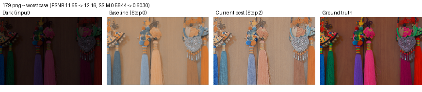
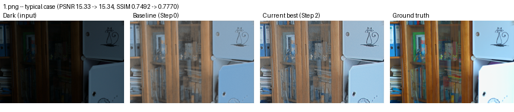
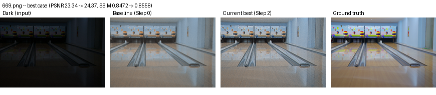
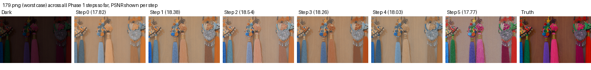

# Visual Progress

A snapshot of where the model stands right now — not a log of every step
(that's `PROGRESS.md`). This file gets **replaced**, not appended to, as
the current best checkpoint changes. Three `eval15` images, picked to cover
the range: a worst case, a typical case, and a best case (by PSNR).

Current best: Run 10 (Step 6, SSIM-based loss, 50 epochs) — PSNR 18.95,
SSIM 0.7671. (Step 7, augmentation on top of this, was tried next but
scored slightly lower — 18.63/0.7633 — so it didn't become the new best;
see `PROGRESS.md` Run 11. Images below are not yet regenerated for Step 6
since the visual failure mode they're illustrating is unchanged.)

## Worst case — 179.png

## Typical case — 1.png

## Best case — 669.png

## Takeaway

The model clearly brightens images and recovers overall structure — a real
improvement over the dark input. The consistent gap to ground truth is
**color and saturation loss**, most visible in the worst case (179.png):
vivid pink/purple/green tassels come out washed-out beige/brown/blue.
Steps 0-4 (training time, learning rate, width, depth) all show this same
pattern — none of them fix it. Expected fix: Step 8 (skip connections),
since the current architecture has no path to carry fine detail forward
from early layers to the output.

## All steps side by side — 179.png

**Notable mismatch between metrics and visuals:** Step 5 (BatchNorm) scored
*worst* on PSNR/SSIM (17.77/0.6822), but visually it's the only run that
recovers real color variety in the tassels (pink, green visible — not just
washed-out brown/blue like Steps 0-4). PSNR/SSIM measure exact pixel-level
match to ground truth, so BatchNorm's output can be "more colorful but
not accurately colored" and still score lower than a safer, flatter,
duller output that happens to average closer to the target. Worth keeping
in mind for later steps — the metrics are a useful proxy, not the full
picture, and are worth cross-checking against what the image actually
looks like.

This section will be updated once a step produces a visibly different
result worth re-capturing — not after every incremental step.
