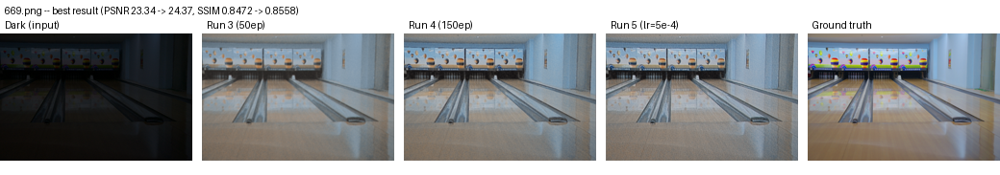
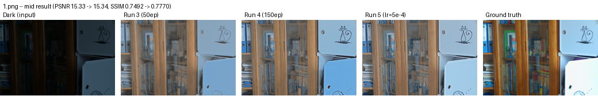
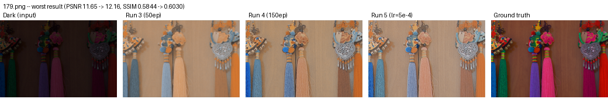
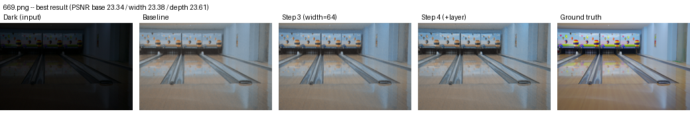
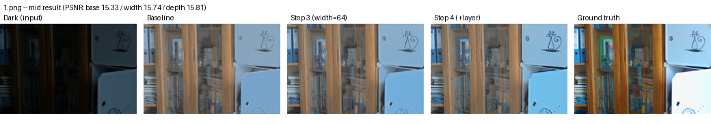
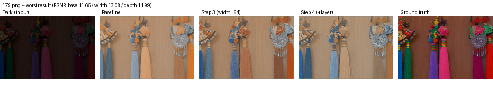

# Visual Progress

Side-by-side comparisons on `eval15` images (never seen during training),
across the runs logged in `PROGRESS.md`. Numbers are PSNR/SSIM for that
specific image (not the dataset average).

## Best result — 669.png

PSNR 23.34 (Run 3) -> 24.37 (Run 5), SSIM 0.8472 -> 0.8558

All three runs recover the scene well here — close to ground truth, colors
mostly intact.

## Mid result — 1.png

PSNR 15.33 (Run 3) -> 15.34 (Run 5), SSIM 0.7492 -> 0.7770

Structure is recovered, but color is noticeably flatter/bluer than ground
truth, especially visible in the shelf's background books.

## Worst result — 179.png

PSNR 11.65 (Run 3) -> 12.16 (Run 5), SSIM 0.5844 -> 0.6030

This is where the architecture's limits are most visible: the ground truth
has vivid pink/purple/green tassels, but all three model outputs wash them
out to muted beige/brown/blue. Brightness recovers fine, but **color and
saturation are lost** — consistent with a simple 3-layer CNN with no skip
connections (it has to reconstruct fine color detail from a heavily
downsampled internal representation, with nothing carrying the original
detail forward).

## Takeaway (hyperparameter changes: Steps 1-2)

Across all three runs (baseline, 150 epochs, tuned LR), the *visual*
difference between them is small — matching the small PSNR/SSIM gaps in
`PROGRESS.md`. The real gap is between any of our runs and ground truth,
and it shows up consistently as **loss of color/saturation**, not loss of
brightness or structure. That's a concrete, visual reason to expect Step 8
(skip connections) to matter more than further tuning Steps 3-7 alone —
though per the roadmap, those are still worth testing individually first.

## Structural changes — baseline vs width (Step 3) vs depth (Step 4)

Same three images, now comparing the baseline architecture against the two
structural changes tried so far.

### 669.png (best)

### 1.png (mid)

### 179.png (worst)

**Takeaway:** visually, Step 3 (width) and Step 4 (depth) look almost
identical to the baseline — same washed-out color loss on 179.png as
before. Matches the numbers in `PROGRESS.md`: neither change closes the
color/saturation gap to ground truth. Reinforces that this specific failure
mode needs something structurally different (skip connections, Step 8),
not just more capacity in the same shape of network.
